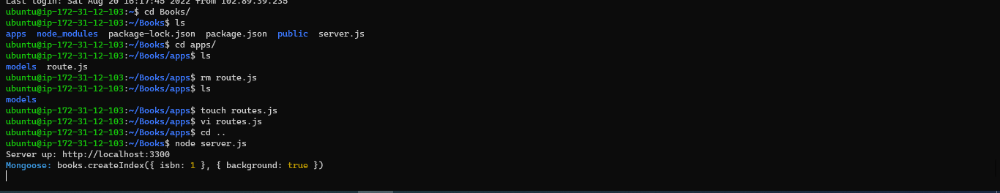

# Project 4 - MEAN Stack Implementation

#### MEAN Stack is a software stack that completely uses JavaScript to build dynamic web application. In this Project I am going to implement a simple Book Register web form using MEAN stack.
___
___
## **Step 1 - SETTING UP UBUNTU PACKAGES & INSTALLING NODE JS**
___
>### Installing Ubuntu’s package manager ‘apt’ 

#### To update a list of packages in package manager for Node like apt for Ubuntu the following set of commands are run;
* *`sudo apt update`* - (Updated Ubuntu)
* *`sudo apt upgrade`* - (Upgrades Ubuntu)
* *`sudo apt -y install curl dirmngr apt-transport-https lsb-release ca-certificates`* -  (Adds Certificates)

>### Installing Node.js Files
Node.js is a JavaScript runtime environment it is used to write the server-side (backend) of the web application.
* *`curl -fsSL https://deb.nodesource.com/setup_18.x | sudo -E bash -`* - (Gets the location of Node.js software from Ubuntu repositories.)
* *`sudo apt-get install -y nodejs`* - (Install Node.js on the server)
* *`node -v `* - (Checks version of Node)
* *`npm -v`* - (Checks version on NPM. NPM is a package manager for Node like apt for Ubuntu, it is used to install Node modules & packages and to manage dependency conflicts.)

## **Step 2 - INSTALL MONGODB, NPM & CREATING THE BACKEND DIRECTORIES & FILES**
___
>### Installing MongoDB
MongoDB is a document based No SQL Database System. MongoDb stores dtat in JSOn Like format called BSON(Binary JSON) and stores the data in a document.
* *`sudo apt-key adv --keyserver hkp://keyserver.ubuntu.com:80 --recv 0C49F3730359A14518585931BC711F9BA15703C6`* - (Imports the public key used by the package management system)
* *`echo "deb [ arch=amd64 ] https://repo.mongodb.org/apt/ubuntu trusty/mongodb-org/3.4 multiverse" | sudo tee /etc/apt/sources.list.d/mongodb-org-3.4.list`* - (Creates a list file forthe version of Ubuntu running)
* *`sudo apt install -y mongodb`* - ( Install MongoDB)
* *`sudo service mongodb start`*- ( Start The server)
* *`sudo systemctl status mongodb`*- (Verifies that the service is up and running)

>### Install NPM -Node package manager.
NPM is Node.js in-built package manager. NPM manages package by installing the user specified version of the package.
* *`sudo apt install -y npm`* - (EInstalls npm – Node package manager.)
* *`sudo npm install body-parser`* - (Install body-parser package. We need ‘body-parser’ package to help us process JSON files passed in requests to the server.)

>### Creating the Backend Directories and Files for the Book Register.
##### To create the Directories and coresponding files
* *`mkdir Books && cd Books`*- (Create a folder named ‘Books’ and Opens the directory)
* *`cd routes`* - (Enters into the Directory)
* *`npm init`*- (In the Books directory, Initialize npm project)
* *`vi server.js`*-  (Opens a text editor window to edit the server.js file in Books directory)

>## **Step 3- INSTALL EXPRESS & SETTING UP ROUTES TO THE SERVER**
___
>### Install Mongoose
The ExpressJS is a server side web application for Node.js, it allows to easily build a common web application features such as Routing and Templating etc. For this Project ExpressJS is used to pass Book information to and from our MongoDB database
* *`sudo npm install express mongoose`*-   ( Mongoose package which provides a straight-forward, schema-based solution to model your application data. We will use Mongoose to establish a schema for the database to store data of our book register.)
>### Creating the Backend Directories and Files for setting up routes to the server.
##### To create the Directories and coresponding files
* *`mkdir apps && cd apps`*-  (In ‘Books’ directory, create a directory named apps and opens it)
* *`touch routes.js`* - (Create a file routes.js)
* *`vi routes.js`*-  (Opens a text editor window to edit the routes.js file in Books directory)
* *`mkdir models && cd models`*-  (In ‘Books/apps’ directory, create a directory named models and opens the directory)
* *`touch book.js`* - (Create a file book.js)
* *`vi book.js`*-  (Opens a text editor window to edit the book.js file in Books directory)

## **Step 4 ACCESSING THE ROUTES WITH AngularJS**
___
>### Creating the Frontend Directories and Files for setting view to the web applicattion.
AngularJS provides a frontend web framework for creating dynamic views in your web applications. In this project AngularJS will be used to connect the web page with Express and perform actions on the Book register.
##### To create the Directories and coresponding files
* *`mkdir public && cd public`*- (In the Books, Create a folder named ‘public’ and Opens the directory)
* *`touch script.js`* - (In the public directory Create a file script.js)
* *`vi script.js`*-  (Opens a text editor window to edit the script.js file in Books directory)
* *`touch index.html`* - (In the public directory Create a file index.html)
* *`vi index.html`*-  (Opens a text editor window to edit the index.html file in Books directory)
* *`node server.js`*- (In the Books, node server.js startsup the server.)

Using the url http://localhost:3300 the Web page can be access and updated as shown below.
